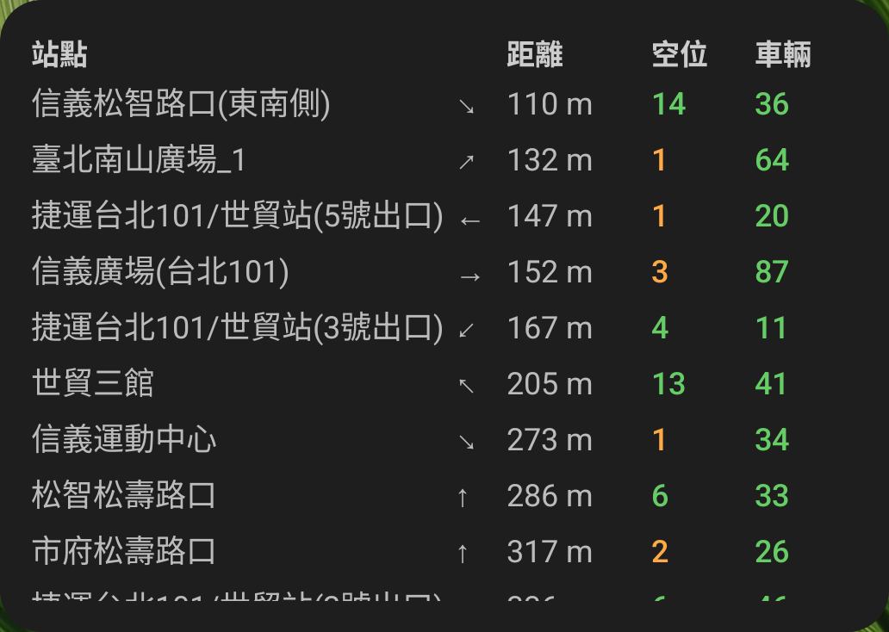

# YouBike Widget

An Android widget that displays real-time YouBike station availability in Taipei.



## Features

- Shows **2 nearest stations** based on your location
- Displays up to **3 favorite stations** (configurable)
- Table format showing:
  - Station name (Chinese)
  - Distance from current location
  - Available spots (for returning bikes)
  - Available bikes (for renting)
- Color-coded availability (green/yellow/red)
- Dark mode support
- Updates every 10 minutes in the background
- Timestamp showing data freshness

## Requirements

- Android 15 (API 35) or higher
- Location permission (optional, for nearest stations)
- Internet connection

## Quick Start (NixOS)

```bash
# Enter development shell
nix develop

# Build and install on connected phone
build-apk assembleDebug
adb install -r app/build/outputs/apk/debug/app-debug.apk
```

Then add the widget: long-press home screen → Widgets → **YouBike 站點**

## Building

### Using Nix (NixOS)

```bash
# Enter development shell
nix develop

# Build debug APK (uses steam-run for FHS compatibility)
build-apk assembleDebug

# Build release APK
build-apk assembleRelease
```

The APK will be at `app/build/outputs/apk/debug/app-debug.apk`.

### Using GitHub Actions

Push to the `main` branch or create a tag starting with `v` (e.g., `v1.0.0`) to trigger a build. APKs are available as workflow artifacts.

### Standard Android Build

```bash
# Requires Android SDK and JDK 17
./gradlew assembleDebug
```

## Configuration

### Favorite Stations

Edit `app/src/main/kotlin/me/danielschaefer/android/youbike/Config.kt`:

```kotlin
val FAVORITE_STATION_IDS = listOf(
    "500101232", // 捷運古亭站(3號出口)
    "500101105", // 和平金山路口
    "500112054", // 松山高中
)
```

### Finding Station IDs

Use the included helper script:

```bash
# Download fresh data
curl -s "https://tcgbusfs.blob.core.windows.net/dotapp/youbike/v2/youbike_immediate.json" -o sample_data.json

# Search by name or area
python find_stations.py 大安
python find_stations.py "MRT"
python find_stations.py 捷運

# List all areas
python find_stations.py --areas
```

## Installation

### Via ADB (recommended)

Connect your phone via USB with USB debugging enabled:

```bash
# Check device is connected
nix develop --command adb devices

# Install (use -r to reinstall/update)
nix develop --command adb install -r app/build/outputs/apk/debug/app-debug.apk
```

### Manual Installation

1. Transfer `app/build/outputs/apk/debug/app-debug.apk` to your device
2. Install the APK (enable "Install from unknown sources" if needed)

### After Installing

1. Open the **YouBike Widget** app and grant location permission
2. Long-press on your home screen → Widgets → **YouBike 站點**
3. Add the widget to your home screen

## Data Source

Station data is fetched from the official Taipei City Government open data API:
```
https://tcgbusfs.blob.core.windows.net/dotapp/youbike/v2/youbike_immediate.json
```

## Tech Stack

- Kotlin
- Jetpack Compose + Glance (widget UI)
- Ktor (HTTP client)
- WorkManager (background updates)
- FusedLocationProvider (GPS)
- Nix Flakes (reproducible builds)

## License

MIT
